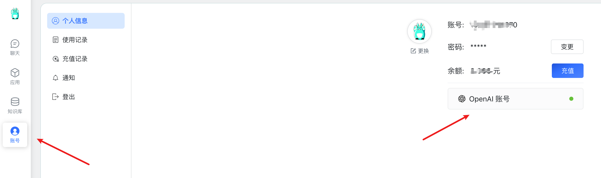
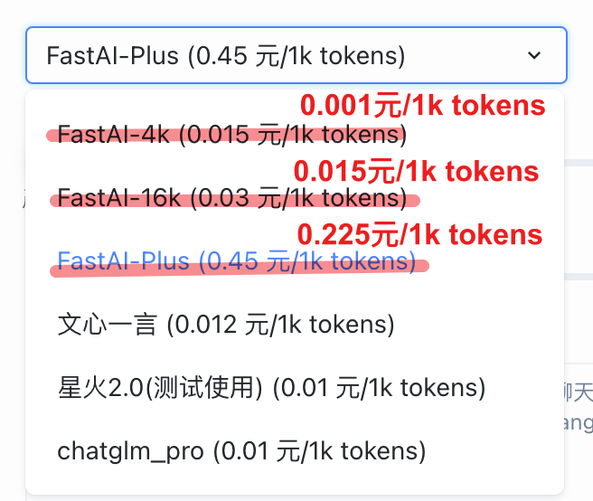
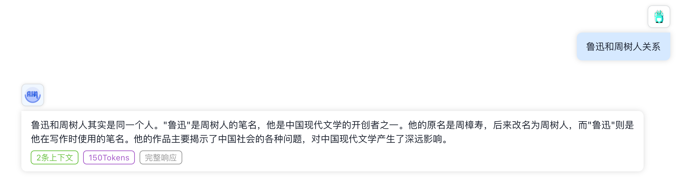
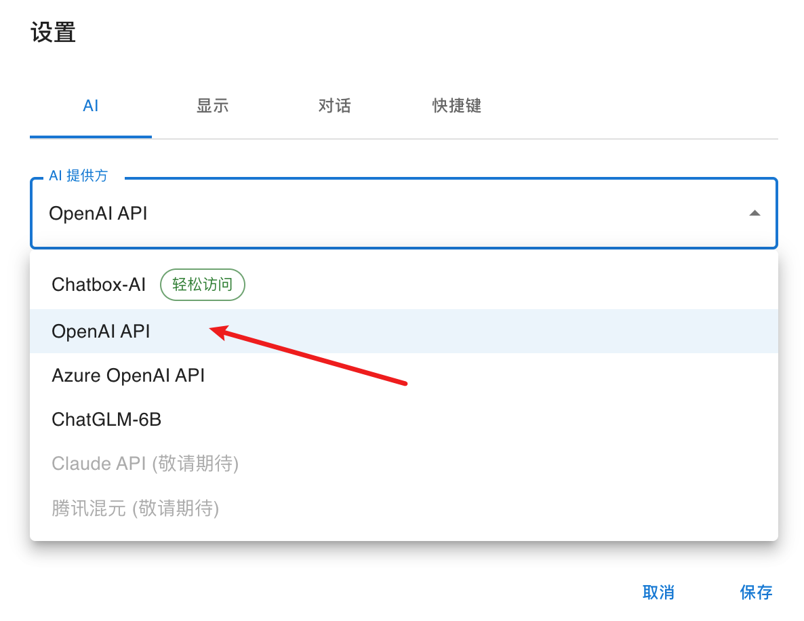
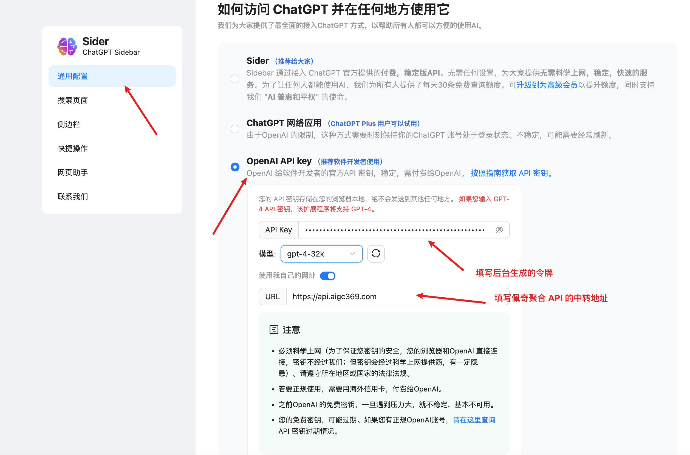

# 如何对接佩奇聚合 API

<div class="callout callout-bg-12">
<p>💡 代码层面无需做任何改动，替换 OpenAI 官方 API 的请求地址为 API 中转地址为 <a href="https://api.aigc369.com">https://api.aigc369.com</a><br>并更换您网站后台生成的令牌（API Key）即可</p>
</div>

## FastGPT

<div class="callout callout-bg-2 callout-border-2">
<p>💡 项目地址：<a href="https://fastgpt.run/">https://fastgpt.run/</a></p>
</div>




API Key：[填写后台生成的令牌地址](https://api.aigc369.com/token)

BaseUrl: https://api.aigc369.com/v1

马上享受官方五折优惠，支持以下所有模型





## ChatBox

ChatGPT 开源桌面应用，支持全部桌面平台。

下载链接：[https://github.com/Bin-Huang/chatbox/releases](https://github.com/Bin-Huang/chatbox/releases)

使用方法：如图在设置中填入购买的密钥，并将代理设置为 [https://api.aigc369.com](https://api.aigc369.com) 即可



## 浏览器插件 ChatGPT Siderbar 

官网链接：[https://chatgpt-sidebar.com/](https://chatgpt-sidebar.com/)

安装好插件后进入设置页面，如图所示修改设置即可。



## 自行编译部署

只需要修改本地的 。env.local 文件，使用下方的环境变量即可：

```text
BASE_URL=https://api.aigc369.com
OPENAI_API_KEY=ak-xxxx
```

## 在 LangChain 中使用

<div class="callout callout-bg-2 callout-border-2">
<p>💡 注意：openai_api_base 的末尾要加上 /v1，而且目前只支持 Chat 模型，请确认不要导入了错误的包。</p>
</div>

```py
from langchain.chat_models import ChatOpenAI

llm = ChatOpenAI(
    openai_api_base="https://api.aigc369.com/v1", # 注意，末尾要加 /v1
    openai_api_key="ak-3133f******fee269b71d",
)

res = llm.predict("hello")

print(res)
```

## **curl 请求**

```text
curl https://api.aigc369.com/v1/chat/completions \
  -H "Content-Type: application/json" \
  -H "Authorization: Bearer sk-xxxxx" \
  -d '{
    "model": "gpt-3.5-turbo",
    "messages": [{"role": "user", "content": "Hello!"}]
  }'
```

## 在官方 openai 库中使用（Python）

```py
import openai

openai.api_base = "https://api.aigc369.com/v1"
openai.api_key = "ak-3133f6*******ee269b71d"

chat_completion = openai.ChatCompletion.create(
    model="gpt-3.5-turbo", messages=[{"role": "user", "content": "ping!"}]
)

print(chat_completion.choices[0].message.content)
```

## DALL-E

```py
openai.api_base = 'https://api.aigc369.com/v1'
openai.api_key = 'sk-xxxxxxxxxxx'

res = openai.Image.create(
    prompt='Cat')print(res)
```

## 开发者接入

如果你是开发者，请查阅 OpenAI 官方 API 文档：

使用时将官方文档中所有的 https://api.openai.com 替换为本服务提供的中转接口地址即可，接口用法与 OpenAI 官方 API 完全一致。

在开始使用之前，你需要用到以下信息：

```text
中转接口地址：https://api.aigc369.com
中转 API Key：ak-xxxxxxxxx
```

