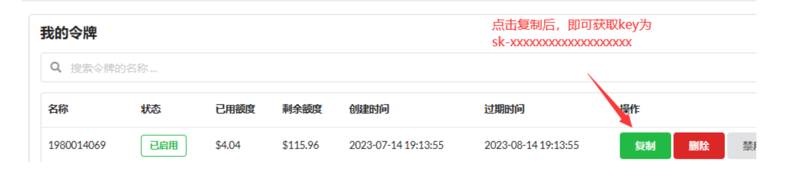

# 开始使用

## 一、注册

您需要在我们的平台[ API.AIGC369.COM ](https://API.AIGC369.COM)进行注册，并通过邮箱验证

## 二、免费试用

首次注册赠送 0.5 美金 ，邀请注册奖励 0.3 美金 /人，可免费测试全部模型，注册赠送的额度 3 天内有效，邀请赠送的额度无过期时间（如需更多测试额度如 GPT-4-32K 和 Claude-2-100K 请联系客服）

邀请注册入口：【[设置](https://api.aigc369.com/setting)】-【个人设置】-【复制邀请链接】

额度用完后可点击顶部【[充值](https://api.aigc369.com/topup)-[获取兑换码](https://aigc666.top)】，充值额度梯度优惠，具体请查看商品介绍

## 三、生成令牌

点击顶部【[令牌](https://api.aigc369.com/token)】，您将生成一个由您自己设置的令牌，可以自己使用，甚至可以继续分发给下游使用，我们支持设置令牌的过期时间和额度。

## 四、更改请求接口地址

您需要将您默认的 OpenAI 请求地址：https://api.openai.com 改为我们的请求地址：[https://api.aigc369.com](https://api.aigc369.com)

全部地址：[https://api.aigc369.com/v1/chat/completions](https://api.aigc369.com/v1/chat/completions)

## 五、更换 Key

您需要将 API Key `sk-*` 更换为在我们平台上自己生成的令牌`sk-*`

## 六、测试与使用

如您在测试过程中遇到任何问题，欢迎[联系我们](https://qm.qq.com/q/Q8pzA08xoI)进行反馈。在使用后您也可以在本站后台查询令牌使用余额、使用日志等

