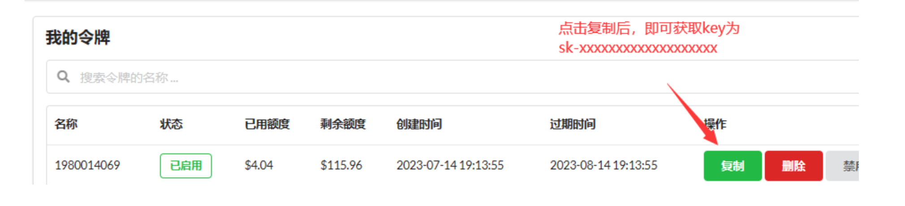
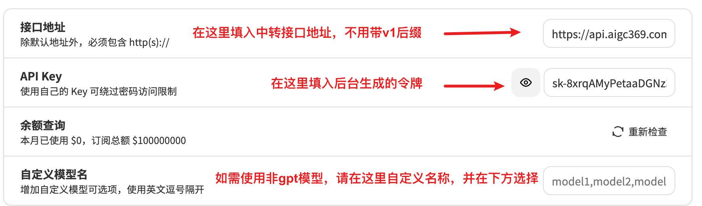
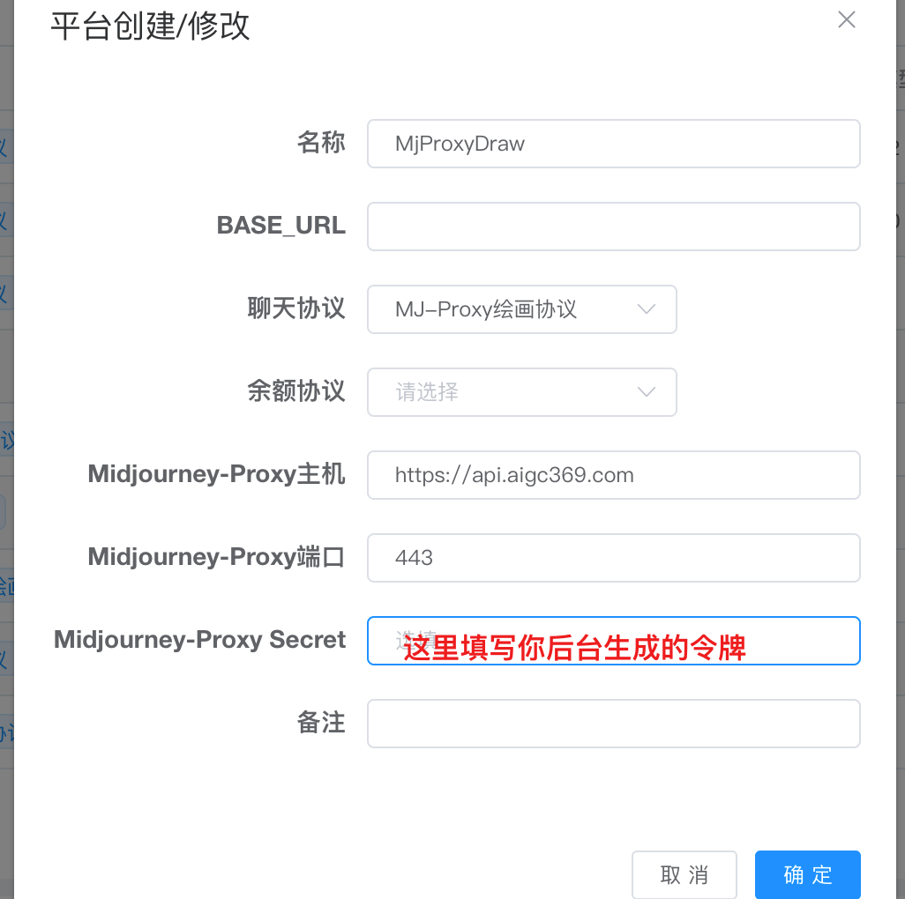

# 「佩奇聚合 API」官方中转 API （支持 AI 全模型和 MJ）

<div class="callout callout-bg-2 callout-border-2">
<p>💡 <strong>全网最稳定的 100%官方 Enterprise 企业级直连 key，超高**<strong>并发</strong></strong>，已稳定运营 8 个月，充值 100 美金以上客户可免费提供<strong><strong>向日葵</strong></strong>远程对接协助**</p>
</div>

<div class="callout callout-bg-2 callout-border-2">
<p>🎉 **主站接口调用地址：**<strong><a href="https://api.aigc369.com">https://api.aigc369.com</a></strong><br>**CF 接口调用地址（国外服务器推荐）：**<strong><a href="https://gpt666.eu.org">https://gpt666.eu.org</a></strong><br><strong>代理接口调用地址：<strong><strong><a href="https://model.aigc369.com">https://model.aigc369.com</a></strong></strong>（已隐藏前台带查询明细，方便代理进行二次销售）</strong></p>
</div>

<div class="callout callout-bg-2 callout-border-2">
<p>🤗 <strong>高<strong><strong>并发</strong></strong>用户或无法访问请联系客服**<strong>添加白名单</strong></strong> IP，出现 <strong><strong>CDN</strong></strong> 回源报错请联系客服获取专用接口调用地址**</p>
</div>

<div class="callout callout-bg-2 callout-border-2">
<p>📌 **本站近期已与「<strong><strong>AI</strong></strong> 实验室」合作：**<strong>AIGC369.COM</strong></p>
</div>

# 什么是佩奇聚合 API

由于 OpenAI 对国内用户做了限制，在很多情况下，国内的网络状况都不允许直连 api.openai.com （OpenAI 的 API 地址），所以我们推出了此中转服务

- **通过佩奇聚合 ****API****，你无需科学上网，可在全球任何地区直接使用和调用**
- **通过佩奇聚合 ****API****，你无需担心封号问题，并且我们每分钟支持的请求数是个人注册账号的 1200 倍**
- **通过佩奇聚合 ****API****，你无需拥有模型的权限，可直接使用和调用包括 ****GPT-3.5**** 各版本、****GPT-4**** 各版本、GPT-4-32K 各版本、🤖 GPT-4V 多模态、🎨 DALL·E 3、🎨 Midjourney、Claude-2（100K）、文心一言文心千帆（V4.0）、阿里通义千问、清华 ChatGLM、科大讯飞星火认知（V3.0）、360 智脑、腾讯混元等国内外最新模型**
- **通过佩奇聚合 ****API****，你无需任何开发基础，可直接使用和调用**
- **通过佩奇聚合 ****API****，你无需频繁更换 API key，一个 API key 即可使用所有模型，并且支持给每一个 key 设置使用时间和余额，方便你进行二次销售**
- **通过佩奇聚合 ****API****，聊天记录只有你自己看到，我们只做 API 中转步骤，100%确保隐私安全**
- **通过佩奇聚合 ****API****，得益于我们强大的美国公司渠道优势，你可以享受远低于官方的价格的使用模型**

# **为什么要选择佩奇聚合 ****API**

|   |**佩奇聚合 ****API**|**官方 ****API**|
|---|---|---|
|**支持 ****GPT-4**** 等模型**|**✅****（支持各种模型）**|**❌（需要账号有 4.0 权限）**|
|**享受最高调用速度**|**✅**|**❌（需要绑卡付费 48 小时后）**|
|多账号**保证高****并发**|**✅（数百个账号）**|**❌（单个账号 ****API**** 有限制）**|
|无需注册** ****OpenAI**** 账号**|**✅**|**❌（需要科学和绑定国外手机）**|
|**额度永不过期**|**✅**|**❌（三个月到期）**|
|**0 封号**|**✅**|**❌（随时无故封号）**|
|**查看每条使用明细**|**✅（实时查看，保留 30 天）**|**❌（只能看到延迟总消耗）**|
|**无需代理访问**|**✅**|**❌（需要在可支持的地区使用）**|
|**计费规则**|**折扣**|**原价**|
|**接口地址**|**https://api.aigc369.com**|**https://api.openai.com**|

# 开始使用

## 一、注册

您需要在我们的平台[ API.AIGC369.COM ](https://API.AIGC369.COM)进行注册，并通过邮箱验证


## 二、免费试用

首次注册赠送 0.5 美金 ，邀请注册奖励 0.3 美金 /人，可免费测试全部模型，注册赠送的额度 3 天内有效，邀请赠送的额度无过期时间（如需更多测试额度如 GPT-4-32K 和 Claude-2-100K 请联系客服）

邀请注册入口：【[设置](https://api.aigc369.com/setting)】-【个人设置】-【复制邀请链接】

额度用完后可点击顶部【[充值](https://api.aigc369.com/topup)-[获取兑换码](https://aigc666.top)】，充值额度梯度优惠，具体请查看商品介绍


## 三、生成令牌

点击顶部【[令牌](https://api.aigc369.com/token)】，您将生成一个由您自己设置的令牌，可以自己使用，甚至可以继续分发给下游使用，我们支持设置令牌的过期时间和额度。




## 四、更改请求接口地址

您需要将您默认的 OpenAI 请求地址：https://api.openai.com 改为我们的请求地址：[https://api.aigc369.com](https://api.aigc369.com)

全部地址：[https://api.aigc369.com/v1/chat/completions](https://api.aigc369.com/v1/chat/completions)

## 五、更换 Key

您需要将 API Key `sk-*` 更换为在我们平台上自己生成的令牌`sk-*`

## 六、测试与使用

如您在测试过程中遇到任何问题，欢迎[联系我们](https://qm.qq.com/q/Q8pzA08xoI)进行反馈。在使用后您也可以在本站后台查询令牌使用余额、使用日志等

# 中转 API 充值汇率折扣

<div class="callout callout-bg-2 callout-border-2">
<p>💡 <strong>点击进入额度充值页面</strong><strong>（支持开发票）</strong><br><strong>实际使用费用=充值优惠<em>官方计费优惠</em>VIP 会员优惠</strong><br>**假如你充值 100 美金额额度，使用的是官方计费 5 折，是网站的 SVIP，您的最终价格为官方的 2.1 折【3.4/7.2（充值优惠）<em>0.5（官方计费优惠）<em>0.9（会员优惠）=0.21】</em></em></p>
</div>

**充值 1 美金官方额度=5 元（1 美金只需 5 元）**

**充值 5 美金官方额度=25 元（1 美金只需 5 元）**

**充值 25 美金官方额度=110 元（1 美金只需 4.4 元）**

**充值 100 美金官方额度=340 元（1 美金只需 3.4 元）**

**充值 500 美金官方额度=1500 元（1 美金只需 3 元）**

**充值 5000 美金官方额度=12500 元（1 美金只需 2.5 元）**

**充值 30000 美金官方额度=43000 元（1 美金只需 1.5 元）**

**一手代理招募进行中****，可享受所有商品代理价，由于我们需要根据**** API ****使用量提前进行采购，所以预存越多优惠越多，充值后可以随时使用，永久有效**

# 接口支持程度和定价

> **1 倍率 = $0.002 / 1K tokens（3.5 模型基准倍率），比如 ****gpt-4**** 的 15 倍率就是$0.03 / 1K tokens**
> 补全倍率：GPT3.5 固定为 1.33，GPT4 为 2，与官方保持一致，其他以官方接口返回为准
> 可参考[12、OpenAI API 知识科普](WKv0wxTVpivDyxkabGYcz2mXnXb) 
> 注意：最近在各大交易群出售超低价 API 商家，标价 1 元 1 美金，然后后台设置的倍率比官方高了 10 倍，实际价格直逼 10 元 1 美金，通常几十刀起，只给 key 和查询余额地址没有使用明细，导致你还很难发现扣费异常，这纯属欺骗消费者，我们强烈谴责，请注意鉴别，认准官方计费 API

# 会员优惠

<div class="callout callout-bg-2 callout-border-2">
<p>💡 会员价格会随着网站模型更新不断上涨，请知悉，已购买的用户不受影响<br>永久 VIP 为 648 元（含 50 美金额度），享受全模型额外 9.5 折<br>永久 SVIP 为 1888 元（含 100 美金额度），享受全模型额外 9 折</p>
</div>

# 二次分销方法

<div class="callout callout-bg-2 callout-border-2">
<p>😘 我们给广大用户提供二次销售专用接口渠道，您的客户不会看到佩奇聚合 API 的前台，并且可以自由查询您给他分发的 API 额度和使用明细<br>请求地址填写：<a href="https://model.aigc369.com%EF%BC%88%E6%94%AF%E6%8C%81%E6%89%80%E6%9C%89%E7%94%A8%E6%88%B7%E4%BD%BF%E7%94%A8%EF%BC%89">https://model.aigc369.com（支持所有用户使用）</a><br>令牌使用您后台创建的即可<br>如果您希望以更低的价格拿货，欢迎申请加入代理：<a href="YJAhdam6roCTGxx3ym8cCwGnnzc">「AI 佩奇创意工坊」代理使用手册</a></p>
</div>

# 快速使用方法

<div class="callout callout-bg-2 callout-border-2">
<p>💡 进入 ChatGPT 网址：<a href="https://hello.aigc666.top/">HELLO.AIGC666.TOP</a><br>按照下图方法进行设置即可开始使用</p>
</div>




# Midjourney 绘图接入

出图失败自动回滚额度，可在日志中查看



# 第三方模型接入

<div class="callout callout-bg-2 callout-border-2">
<p> <strong>和 <strong><strong>ChatGPT</strong></strong> 接入类似，填写中转地址和令牌即可，需要注意后台模型名称必须与下方一致，参考**<strong>接口支持程度和定价</strong></strong>，部分模型举例如下：**<br>文心一言模型名称：【ERNIE-Bot】<br>清华-ChatGLM 模型名称**：【<strong>chatglm_pro</strong>】**<br>讯飞星火认知模型名称：【SparkDesk】<br>Claude2 模型名称（支持 100K）：【claude-2】</p>
</div>

# 第三方模型**测试**

<div class="callout callout-bg-2 callout-border-2">
<p>📚 进入 ChatGPT 网址：<a href="https://hello.aigc666.top/">HELLO.AIGC666.TOP</a><br>然后按照下图进行模式设置即可开始使用<br>这里以文心一言为例，其他模型同理</p>
</div>


<div class="callout callout-bg-2 callout-border-2">
<p>❗ 注意：你需要在<a href="https://chat.bing666.top/#/settings">设置</a>中把【注入系统级提示信息】选项取消</p>
</div>


# 如何对接佩奇聚合 API

<div class="callout callout-bg-12">
<p>💡 代码层面无需做任何改动，替换 OpenAI 官方 API 的请求地址为 API 中转地址为 <a href="https://api.aigc369.com">https://api.aigc369.com</a><br>并更换您网站后台生成的令牌（API Key）即可</p>
</div>

## FastGPT

<div class="callout callout-bg-2 callout-border-2">
<p>💡 项目地址：<a href="https://fastgpt.run/">https://fastgpt.run/</a></p>
</div>


API Key：[填写后台生成的令牌地址](https://api.aigc369.com/token)

BaseUrl: https://api.aigc369.com/v1

马上享受官方五折优惠，支持以下所有模型


## ChatBox

ChatGPT 开源桌面应用，支持全部桌面平台。

下载链接：[https://github.com/Bin-Huang/chatbox/releases](https://github.com/Bin-Huang/chatbox/releases)

使用方法：如图在设置中填入购买的密钥，并将代理设置为 [https://api.aigc369.com](https://api.aigc369.com) 即可

<div class="grid gap-3 grid-cols-2">
<div>

</div>
<div>

</div>
</div>

## 浏览器插件 ChatGPT Siderbar 

官网链接：[https://chatgpt-sidebar.com/](https://chatgpt-sidebar.com/)

安装好插件后进入设置页面，如图所示修改设置即可。


## 自行编译部署

只需要修改本地的 。env.local 文件，使用下方的环境变量即可：

```text
BASE_URL=https://api.aigc369.com
OPENAI_API_KEY=ak-xxxx
```

## 在 LangChain 中使用

<div class="callout callout-bg-2 callout-border-2">
<p>💡 注意：openai_api_base 的末尾要加上 /v1，而且目前只支持 Chat 模型，请确认不要导入了错误的包。</p>
</div>

```py
from langchain.chat_models import ChatOpenAI

llm = ChatOpenAI(
    openai_api_base="https://api.aigc369.com/v1", # 注意，末尾要加 /v1
    openai_api_key="ak-3133f******fee269b71d",
)

res = llm.predict("hello")

print(res)
```

## **curl 请求**

```text
curl https://api.aigc369.com/v1/chat/completions \
  -H "Content-Type: application/json" \
  -H "Authorization: Bearer sk-xxxxx" \
  -d '{
    "model": "gpt-3.5-turbo",
    "messages": [{"role": "user", "content": "Hello!"}]
  }'
```

## 在官方 openai 库中使用（Python）

```py
import openai

openai.api_base = "https://api.aigc369.com/v1"
openai.api_key = "ak-3133f6*******ee269b71d"

chat_completion = openai.ChatCompletion.create(
    model="gpt-3.5-turbo", messages=[{"role": "user", "content": "ping!"}]
)

print(chat_completion.choices[0].message.content)
```

## DALL-E

```py
openai.api_base = 'https://api.aigc369.com/v1'
openai.api_key = 'sk-xxxxxxxxxxx'

res = openai.Image.create(
    prompt='Cat')print(res)
```

## 开发者接入

如果你是开发者，请查阅 OpenAI 官方 API 文档：

使用时将官方文档中所有的 https://api.openai.com 替换为本服务提供的中转接口地址即可，接口用法与 OpenAI 官方 API 完全一致。

在开始使用之前，你需要用到以下信息：

```text
中转接口地址：https://api.aigc369.com
中转 API Key：ak-xxxxxxxxx
```

# 如何查询剩余额度

[https://api.aigc369.com/topup](https://api.aigc369.com/topup)

# 如何查询使用明细

[https://api.aigc369.com/log](https://api.aigc369.com/log)

# 常见问题

## 后台额度充足，使用 API 提示额度不足

请确认你后台创建的令牌已经分配好额度是过期时间，一般可以设置成无限制，另外额度不是填写金额，500000 额度=1 美金，可按需填写

## 出现 CDN 回源报错

请联系客服获取企业客户接口地址

## 无法登录？

请确保用户名填写正确，不要填写邮箱地址，是填写你注册时候的用户名，如遇到登录问题无法自行解决，请联系客服，第一时间为您处理

## 提示当前分组下没有可用渠道

请确保模型名称完全和列表一致，并且区分大小写

## API 基础知识科普

[12、OpenAI API 知识科普](WKv0wxTVpivDyxkabGYcz2mXnXb) 

## 如何检验 GPT3.5 还是 GPT4？

请参照该链接提问三个英文经典问题：[https://ssw9noe1h6.feishu.cn/wiki/FytDwtuaEi2E2UkwBjpcdUkdnbh](https://ssw9noe1h6.feishu.cn/wiki/FytDwtuaEi2E2UkwBjpcdUkdnbh)

## 额度是什么？怎么计算的？

额度 = 分组倍率 * 模型倍率 * （提示 token 数 + 补全 token 数 * 补全倍率）
其中补全倍率对于 GPT3.5 固定为 1.33，GPT4 为 2，与官方保持一致。
如果是非流模式，官方接口会返回消耗的总 token，但是你要注意提示和补全的消耗倍率不一样。

## 什么是上下文？

在 GPT 用于文本生成时，它需要考虑之前输入的所有文本上下文，以生成连贯、有意义的句子。随着输入上下文的增加，GPT 生成的文本变得越来越连贯和精准。例如，如果将一篇完整的文章或段落作为输入，GPT 将能生成符合上下文连贯性的自然语言文本。因此，GPT 上下文累积得越多，生成文本的准确度和连贯性呈逐步提升趋势。

## 账户额度足够为什么提示额度不足？

请检查你的令牌额度是否足够，这个和账户额度是分开的。
令牌额度仅供用户设置最大使用量，用户可自由设置。

## ChatGPT Next Web 报错：Failed to fetch

部署的时候不要设置 BASE_URL。
检查你的接口地址和 API Key 有没有填对。

## 网站部分页面打开报错

请清理浏览器缓存 Cookie

## 为什么 gpt-4 额度消耗这么快？

gpt-4 的消耗速度是 gpt-3.5-turbo 的 20 到 40 倍，假设购买了 9w token，我们用 30 倍作为平均倍率，也就是 90000 / 30 = 3000 字左右，加上每次要附带上历史消息，能发的消息数将会进一步减半，在最极限的情况下，一条消息就能把 9w token 消耗完，所以请谨慎使用。

## 使用 Next Web 时，有哪些节省 token 的小技巧？

点开对话框上方的设置按钮，找到里面的设置项：

携带历史消息数：数量越少，消耗 token 越少，但同时 gpt 会忘记之前的对话

历史摘要：用于记录长期话题，关闭后可以减少 token 消耗

注入系统级提示词：用于提升 ChatGPT 的回复质量，关闭后可减少 token 消耗

在对话时，点击对话框上方的机器人图标，可以快捷切换模型，可以优先使用 3.5 问答，如果回答不满意，再切换为 4.0 重新提问。

# 用户协议

<div class="callout callout-bg-2 callout-border-2">
<p>💡 使用即视为同意本协议！否则请不要使用！</p>
</div>

1. 本服务不会以任何形式持久化存储任何用户的任何聊天信息；
2. 本服务不知晓也无从知晓用户在本服务上传输的任何文本内容，用户使用本服务引发的任何违法犯罪后果，由使用者承担，本服务将全力配合由此可能引起的相关调查；
3. 用户在佩奇集合 API 的任何付款行为，均视为对佩奇聚合 API 的捐赠行为，并不与本服务构成交易，也不存在任何法律意义上的合同或契约关系；
4. 本服务视为佩奇聚合 API 项目以及相关项目的辅助调试工具，请勿用于其他用途；
5. 本服务所产生的任何捐赠款项，均会由开发者本人按时在个人所得税 APP 上守法纳税。
6. 我们有权在市场价格剧烈波动时对价格进行合理调整

