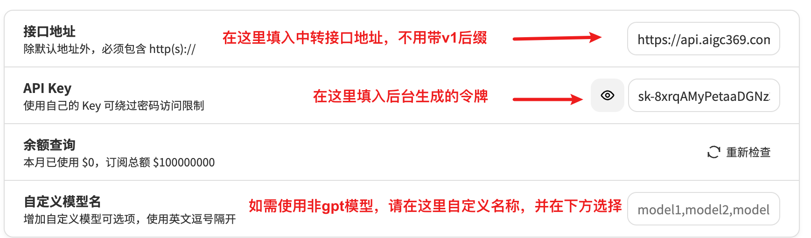
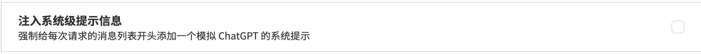

# 第三方模型测试

📚 进入 ChatGPT 网址：<a href="https://hello.aigc666.top/">HELLO.AIGC666.TOP</a> 然后按照下图进行模式设置即可开始使用 这里以文心一言为例，其他模型同理

❗ 注意：你需要在<a href="https://chat.bing666.top/#/settings">设置</a>中把【注入系统级提示信息】选项取消

