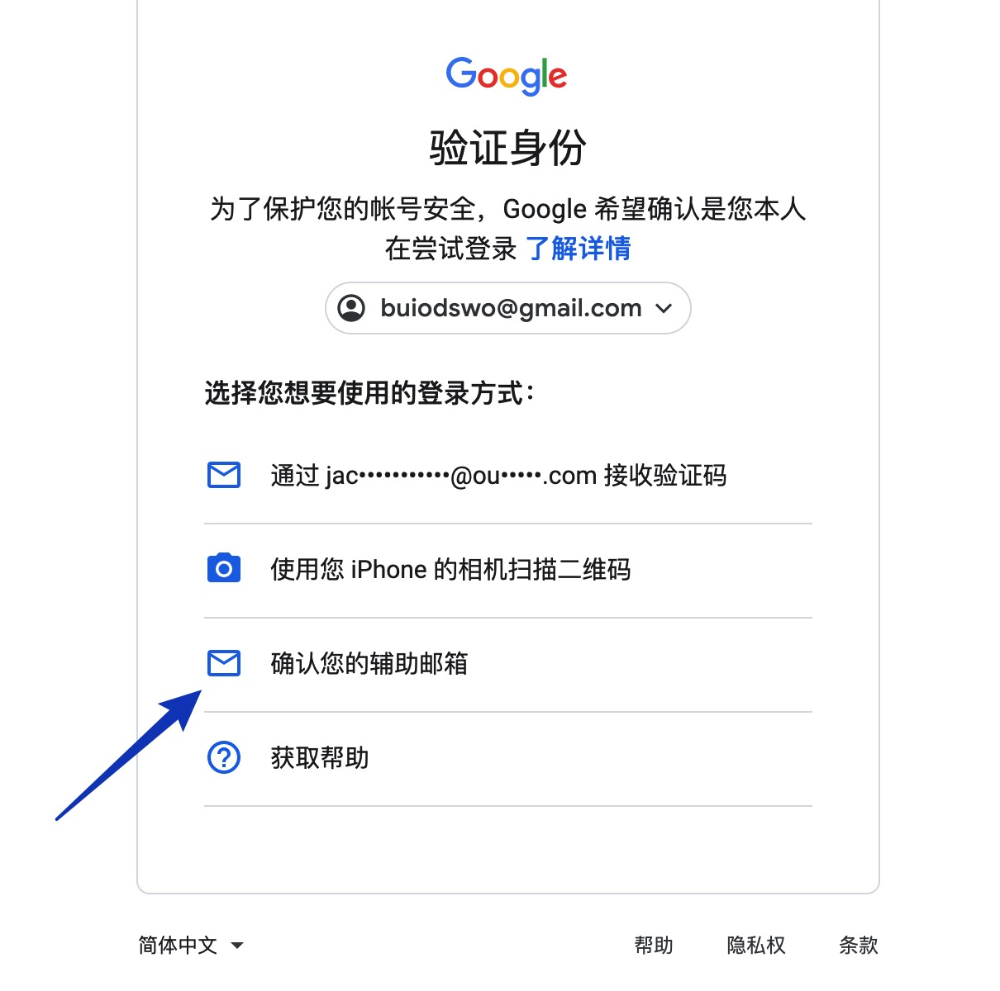

# 谷歌账号 Google Voice 登陆以及常见使用问题

# 登陆常见问题

第一次登陆时请选择确认辅助邮箱而不是使用辅助邮箱接收验证码 如下图所示

# 账号存在异常需要电话验证

直接用你中国号码验证即可，验证活人，不影响隐私，不会绑定。

# 注册 tg 电报收不到短信

用苹果手机下载客户端注册，或者国外安卓手机，原生的安卓系统，国产手机基本上都不行

# 怎么保号

需要注意的是，GV 号长期不用是有可能被谷歌回收的，因此，如果想要长期拥有一个 GV 号，那么需要注意谷歌对于回收号码的政策。

通常来说，如果半年内使用 GV 号码主动发短信或者打电话，那么肯定不会被回收。

此外，Google 在回收前，会提前发邮件给你，如果你没做出应答，回收后的 30 天，你仍可以找回，超过的话，只能重新申请了。

保号的成本其实是很低的，因为 Google Voice 的美国号码拨打美国、加拿大号码是免费的，发短信也是免费的。

